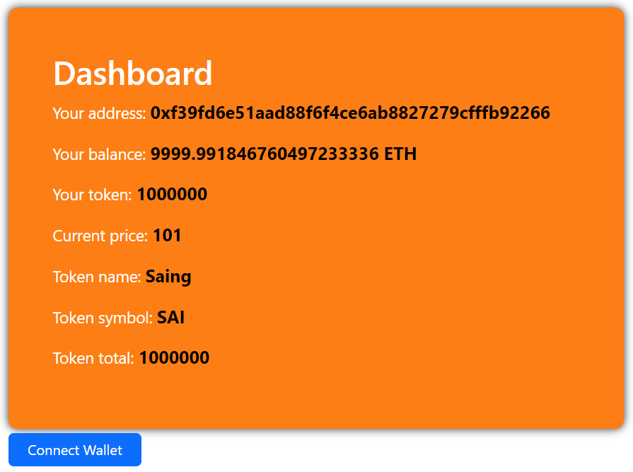
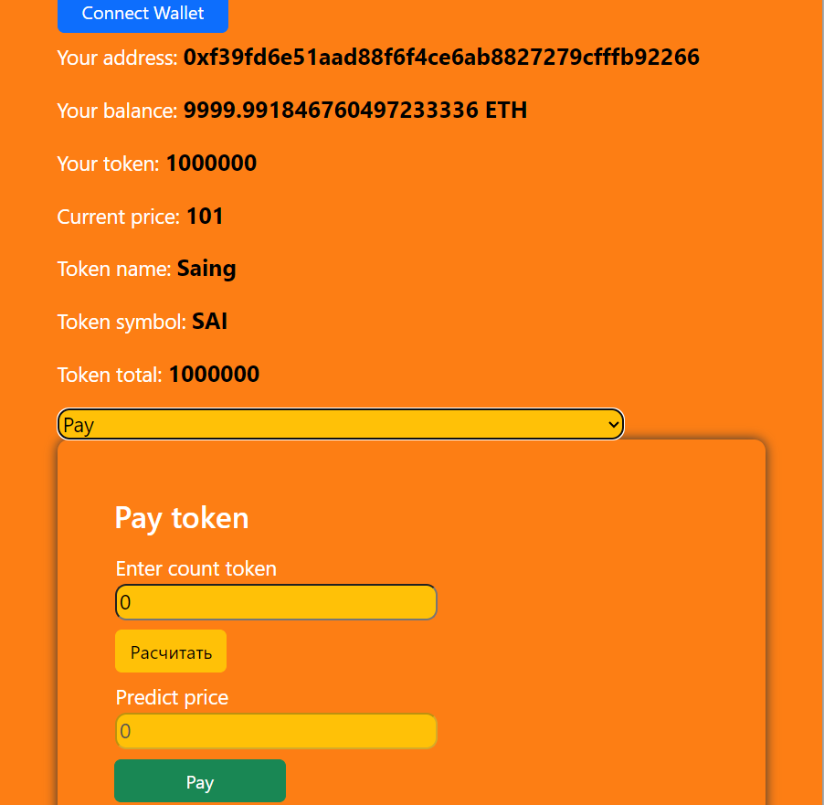
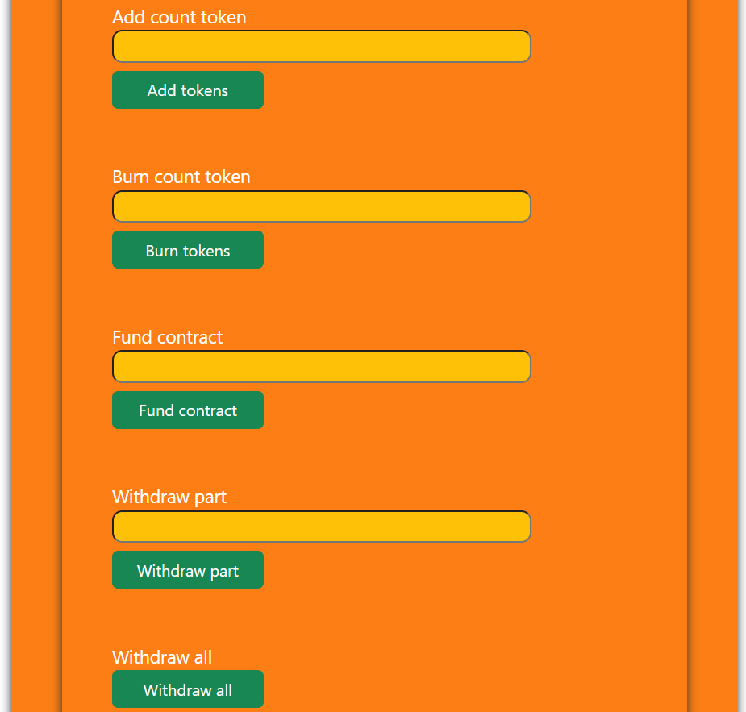

# Token Saing ERC20, vue, hardhat, web3
### Методы:
- покупка токенов;
- продажа токенов;
- перевод токенов;
- добавление токенов;
- сжигание токенов;
- вывод частично суммы с контракта;
- вывод всей суммы с контракта;
- пополнение контракта;

## Contract Solidity
````
// SPDX-License-Identifier: MIT
// Compatible with OpenZeppelin Contracts ^5.0.0
pragma solidity ^0.8.20;

import "@openzeppelin/contracts/token/ERC20/ERC20.sol";
import "@openzeppelin/contracts/token/ERC20/extensions/ERC20Permit.sol";
import "@openzeppelin/contracts/token/ERC20/extensions/ERC20Votes.sol";
import "@openzeppelin/contracts/access/Ownable.sol";

contract Saing is ERC20, ERC20Permit, ERC20Votes, Ownable {
uint256 public nominalVolume;
uint256 public minTokenPrice;
uint256 public priceChangeStep;

    event TokenPurchased(address indexed buyer, uint256 count, uint256 price);
    event TokenSold(address indexed seller, uint256 count, uint256 price);
    event TokenWithDraft(address _owner, uint256 _count, uint256 _timestamp);
    event TokenFundContract(address _owner, uint256 _count, uint256 _timestamp);
    event TokenAdd(address _owner, uint256 _count, uint256 _timestamp);
    event TokenBurn(address _owner, uint256 _count, uint256 _timestamp);

    constructor(
        string memory _name,
        string memory _short,
        uint256 _nominalVolume,
        uint256 _initTokenPrice,
        uint256 _priceChangeStep
    ) ERC20(_name, _short) ERC20Permit(_name) Ownable(msg.sender) {
        _mint(msg.sender, _nominalVolume);
        nominalVolume = _nominalVolume;
        minTokenPrice = _initTokenPrice;
        priceChangeStep = _priceChangeStep;
    }

    // Купить токены
    function buyTokens(uint256 _count) external payable {
        uint256 totalPrice = getTokenPrice() * _count;
        require(msg.value >= totalPrice, "Insufficient funds sent");
        require(
            balanceOf(owner()) >= _count,
            "Not enough tokens available"
        );
        _update(owner(), msg.sender, _count);
        minTokenPrice += priceChangeStep;
        emit TokenPurchased(msg.sender, _count, getTokenPrice());
    }

    // Продать токены
    function sellTokens(uint256 _count) external {
        require(balanceOf(msg.sender) >= _count, "Insufficient token balance");
        uint256 totalPrice = getTokenPrice() * _count;
        require(
            address(this).balance >= totalPrice,
            "Insufficient contract balance"
        );
        _update(msg.sender, owner(), _count);
        if (minTokenPrice > priceChangeStep) {
            minTokenPrice -= priceChangeStep;
        }
        payable(msg.sender).transfer(totalPrice);
        emit TokenSold(msg.sender, _count, getTokenPrice());
    }

    // Вывести все
    function withdraftAll() public onlyOwner {
        address payable _to = payable(owner());
        uint256 _count = address(this).balance;
        _to.transfer(_count);
        emit TokenWithDraft(owner(), _count, block.timestamp);
    }

    // Вывести часть средств
    function withdrawPart(uint256 _count) external onlyOwner {
        require(
            address(this).balance >= _count,
            "Insufficient contract balance"
        );
        payable(owner()).transfer(_count);
        emit TokenWithDraft(owner(), _count, block.timestamp);
    }

    // Положить деньги на контракт
    function fundContract() external payable onlyOwner {
        emit TokenFundContract(msg.sender, msg.value, block.timestamp);
    }

    // Добавить токены
    function addToken(uint256 _count) public onlyOwner {
        _mint(owner(), _count);
        emit TokenAdd(owner(), _count, block.timestamp);
    }

    // Сжечь часть токенов
    function burn(uint256 _count) public onlyOwner {
        _burn(owner(), _count);
        emit TokenBurn(owner(), _count, block.timestamp);
    }

    function _update(
        address from,
        address to,
        uint256 value
    ) internal override(ERC20, ERC20Votes) {
        super._update(from, to, value);
    }

    function nonces(address owner)
        public
        view
        override(ERC20Permit, Nonces)
        returns (uint256)
    {
        return super.nonces(owner);
    }

    function getTokenPrice() public view returns (uint256) {
        return minTokenPrice;
    }

    function getBalance() public view onlyOwner returns (uint256) {
    return address(this).balance;
}

}
`````
## Test contract
````
import {expect} from "chai";
import {ethers} from "hardhat";
import {loadFixture} from "@nomicfoundation/hardhat-toolbox/network-helpers";
import {extendEnvironment} from "hardhat/config";

describe("Saing", function () {
async function deployTokenFixture() {
const ContractFactory = await ethers.getContractFactory("Saing");
const [owner, user1, user2, user3] = await ethers.getSigners();
const instance = await ContractFactory.deploy("Saing", "SAI", 1000000, 100, 1);
await instance.waitForDeployment();
return {instance, owner, user1, user2, user3};
}

    it("Test deploy", async function () {
        const {instance, owner, user1, user2, user3} = await loadFixture(deployTokenFixture);
        expect(await instance.name()).to.equal("Saing");
        expect(await instance.symbol()).to.equal("SAI");
        expect(await instance.totalSupply()).to.equal(1000000);
        expect(await instance.balanceOf(owner.address)).to.equal(1000000);
        expect(await instance.balanceOf(user1.address)).to.equal(0);
        expect(await instance.balanceOf(user2.address)).to.equal(0);
        expect(await instance.balanceOf(user3.address)).to.equal(0);
        expect(await instance.owner()).to.equal(owner.address);
    });
    it("Test buyTokens", async function () {
        const {instance, owner, user1, user2, user3} = await loadFixture(deployTokenFixture);
        await instance.connect(user1).buyTokens(10, {value: 1000});
        expect(await instance.balanceOf(user1.address)).to.equal(10);
        expect(await instance.balanceOf(owner.address)).to.equal(999990);
        expect(await ethers.provider.getBalance(instance.getAddress())).to.equal(1000);
        // Проверка события
        const filter = instance.filters.TokenPurchased();
        const events = await instance.queryFilter(filter);
        expect(events.length).to.be.greaterThan(0);
        expect(await instance.getTokenPrice()).to.equal(101);
        await expect(instance.connect(user2).buyTokens(10, {value: 101})).to.be.revertedWith("Insufficient funds sent");
        await expect(instance.connect(user2).buyTokens(10000000, {value: 10000000001})).to.be.revertedWith("Not enough tokens available");
    });
    it("Test sellTokens", async function () {
        // Загружаем фикстуру
        const {instance, owner, user1, user2, user3} = await loadFixture(deployTokenFixture);
        // Покупаем токены
        await instance.connect(user1).buyTokens(10, {value: 1000});
        expect(await instance.balanceOf(user1.address)).to.equal(10);
        // Продаем токены больше чем есть
        await expect(instance.connect(user1).sellTokens(11)).to.be.revertedWith("Insufficient token balance");
        // Обнуляем контракт
        await instance.withdraftAll()
        expect(await ethers.provider.getBalance(instance.getAddress())).to.equal(0);
        // Продаем токены при балансе больше чем в контракте
        await expect(instance.connect(user1).sellTokens(10)).to.be.revertedWith("Insufficient contract balance");
        // Проверяем как изменилась цена
        expect(await instance.getTokenPrice()).to.equal(101);
        // Покупаем токены
        await instance.connect(user2).buyTokens(10, {value: 1010});
        expect(await instance.balanceOf(user2.address)).to.equal(10);
        // Проверяем как изменилась цена
        expect(await instance.getTokenPrice()).to.equal(102);
        let before = await ethers.provider.getBalance(user2.address);
        // Продаем токены
        await instance.connect(user2).sellTokens(9);
        expect(await instance.balanceOf(user2.address)).to.equal(1);
        // Проверяем как изменилась цена
        expect(await instance.getTokenPrice()).to.equal(101);
        // Проверяем события
        const filter = instance.filters.TokenSold();
        const event = await instance.queryFilter(filter);
        expect(event.length).to.be.greaterThan(0);
        expect(await instance.balanceOf(owner.address)).to.equal(999989);
        expect(await ethers.provider.getBalance(instance.getAddress())).to.equal(1010 - 9 * 102);
        expect(await instance.getTokenPrice()).to.equal(101);
        let after = await ethers.provider.getBalance(user2.address);
        expect(before).to.be.greaterThan(after);
    });
    it("Test with draft", async function () {
        const {instance, owner, user1, user2, user3} = await loadFixture(deployTokenFixture);
        // Покупаем токены
        await instance.connect(user1).buyTokens(100, {value: 10000});
        expect(await ethers.provider.getBalance(instance.getAddress())).to.equal(10000);
        // Снимаем токены
        await instance.withdrawPart(100);
        expect(await ethers.provider.getBalance(instance.getAddress())).to.equal(9900);
        // Снимаем все
        await instance.withdraftAll();
        expect(await ethers.provider.getBalance(instance.getAddress())).to.equal(0);
        // Снимаем больше чем есть
        await expect(instance.withdrawPart(100)).to.be.revertedWith("Insufficient contract balance");
        // Проверяем события
        const filter = instance.filters.TokenWithDraft();
        const event = await instance.queryFilter(filter);
        expect(event.length).to.be.greaterThan(0);
    });

    it("Test fund contract", async function () {
        const {instance, owner, user1, user2, user3} = await loadFixture(deployTokenFixture);
        // Проверяем что контракт пустой
        expect(await ethers.provider.getBalance(instance.getAddress())).to.equal(0);
        // Пополняем счет пользователями
        await expect(instance.connect(user2).fundContract({value: 10000})).to.be.revertedWithCustomError(instance, "OwnableUnauthorizedAccount");
        // Пополняем контракт
        await instance.connect(owner).fundContract({value: 10000});
        expect(await ethers.provider.getBalance(instance.getAddress())).to.equal(10000);
        // Проверяем события
        const filter = instance.filters.TokenFundContract();
        const event = await instance.queryFilter(filter);
        expect(event.length).to.be.greaterThan(0);
    });
    it("Test add token", async function () {
        const {instance, owner, user1, user2, user3} = await loadFixture(deployTokenFixture);
        // Проверяем сколько токенов в контракте
        expect(await instance.balanceOf(owner.address)).to.equal(1000000);
        // Пополняем токены пользователями
        await expect(instance.connect(user2).addToken(500000)).to.be.revertedWithCustomError(instance, "OwnableUnauthorizedAccount");
        // Пополняем контракт
        await instance.connect(owner).addToken(500000);
        expect(await instance.balanceOf(owner.address)).to.equal(1500000);
        expect(await instance.balanceOf(instance.getAddress())).to.equal(0);
        // Проверяем события
        const filter = instance.filters.TokenAdd();
        const event = await instance.queryFilter(filter);
        expect(event.length).to.be.greaterThan(0);
    });
    it("Test burn token", async function () {
        const {instance, owner, user1, user2, user3} = await loadFixture(deployTokenFixture);
        // Проверяем сколько токенов в контракте
        expect(await instance.balanceOf(owner.address)).to.equal(1000000);
        // Сжигаем токены пользователями
        await expect(instance.connect(user2).burn(500000)).to.be.revertedWithCustomError(instance, "OwnableUnauthorizedAccount");
        // Пополняем контракт
        await instance.connect(owner).burn(500000);
        expect(await instance.balanceOf(owner.address)).to.equal(500000);
        expect(await instance.balanceOf(instance.getAddress())).to.equal(0);
        // Проверяем события
        const filter = instance.filters.TokenBurn();
        const event = await instance.queryFilter(filter);
        expect(event.length).to.be.greaterThan(0);
    });
    it("Test from token", async function () {
        const {instance, owner, user1, user2, user3} = await loadFixture(deployTokenFixture);
        expect(await instance.balanceOf(owner.address)).to.equal(1000000);
        expect(await instance.balanceOf(user2.address)).to.equal(0);
        await instance.connect(owner).transfer(user2.address, 500000);
        expect(await instance.balanceOf(owner.address)).to.equal(500000);
        expect(await instance.balanceOf(user2.address)).to.equal(500000);
    });
    it("Test get balance", async function () {
        const {instance, owner, user1, user2, user3} = await loadFixture(deployTokenFixture);
        await instance.connect(owner).fundContract({value: 10000});
        expect(await instance.getBalance()).to.equal(10000);
    });
});
````

## Интерфейс реализации выполнен на vue
### 1. Dashboard

### 2. Client

### 3.Server


## Коды реализации
### Подключение кошелька
````
async _connectWallet() {
      if (window.ethereum) {
        try {
          const addressArray = await window.ethereum.request({
            method: "eth_requestAccounts",
          });
          this.state.selectedAddress = addressArray[0];
          this.state.balance = await this._update_balance(addressArray[0]);
          this.state.priceToken = await this._price();
          this.state.name = await this._nameToken();
          this.state.symbol = await this._symbol();
          this.state.totalSupply = await this._tokenTotal();
          this.state.tokens = await this._tokens();
        } catch (err) {
          if (err.code === 4001) {
            this.state.networkError = "Please connect to MetaMask.";
          } else {
            console.error(err);
          }
        }
      }
````
### Получение данных с контракта
````
async _update_balance(selectedAddress) {
const balance = await window.ethereum.request({method: 'eth_getBalance', params: [selectedAddress, 'latest']});
return web3.utils.fromWei(balance, 'ether') + ' ETH';
},
async _price() {
return await contract.methods.getTokenPrice().call();
},
async _nameToken() {
return await contract.methods.name().call();
},
async _symbol() {
return await contract.methods.symbol().call();
},
async _tokenTotal() {
return await contract.methods.totalSupply().call();
},
async _tokens() {
return await contract.methods.balanceOf(this.state.selectedAddress).call();
}
````
## Пукупка токенов
````
async _pay() {
      try {
        const price = parseInt(this.state.priceToken);
        const countTokens = parseInt(this.state.countTokens);
        const totalPrice = price * countTokens;
        if (this.state.selectedAddress === undefined) {
          alert("Connect your wallet");
          return;
        }
        if (countTokens === 0) {
          alert("Enter count token");
          return;
        }
        const address = contractAddress.Token;
        const contract = new Contract(abi.abi, address, web3);
        const user = web3.utils.toChecksumAddress(this.state.selectedAddress.toString());
        await contract.methods.buyTokens(countTokens)
            .send({value: web3.utils.toWei(totalPrice.toString(), 'wei'), from: user})
            .then(async (data) => {
              await this._transactionSuccess(data.status.toString(), data.transactionHash.toString());
              await this._initialize();
              await this._tokens().then(data => {
                this.state.tokens = data
              })
              await this._connectWallet();
              document.getElementById('price').value = '';
              this.state.countTokens = 0;
            }).catch(() => {
              this.state.errorTransaction("Ошибка проведения транзакции. Попробуйте еще раз.")
            });
      } catch (e) {
        this.state.errorTransaction("Ошибка проведения транзакции. Попробуйте еще раз.")
      }
    },
````
## Продажа токенов
````
async _sell() {
      const price = parseInt(this.state.priceToken);
      const countTokens = parseInt(this.state.countTokens);
      const totalPrice = price * countTokens;
      if (this.state.selectedAddress === undefined) {
        alert("Connect your wallet");
        return;
      }
      if (countTokens === 0) {
        alert("Enter count token");
        return;
      }
      const address = contractAddress.Token;
      const contract = new Contract(abi.abi, address, web3);
      const user = web3.utils.toChecksumAddress(this.state.selectedAddress.toString());
      await contract.methods.sellTokens(countTokens)
          .send({from: user})
          .then((data) => {
            this._transactionSuccess(data.status.toString(), data.transactionHash.toString());
            this._initialize();
            this._tokens().then(data => {
              this.state.tokens = data
            });

          });
      document.getElementById('price').value = '';

    }
````
## Перевод токетов
````
async _fromTo() {
      const countTokens = parseInt(this.state.countTokens);
      if (this.state.selectedAddress === undefined) {
        alert("Connect your wallet");
        return;
      }
      if (countTokens === 0) {
        alert("Enter count token");
        return;
      }
      const address = contractAddress.Token;
      const contract = new Contract(abi.abi, address, web3);
      const owner = web3.utils.toChecksumAddress(this.state.selectedAddress.toString());
      const userAddress = document.getElementById('to').value;
      const user = web3.utils.toChecksumAddress("0xf39Fd6e51aad88F6F4ce6aB8827279cffFb92266");
      console.log(owner, user, countTokens)
      await contract.methods.transferFrom(owner, user, countTokens)
          .send({from: owner})
          .then((data) => {
            this._transactionSuccess(data.status.toString(), data.transactionHash.toString());
            this._initialize();
            this._tokens().then(data => {
              this.state.tokens = data
            });

          });
      document.getElementById('price').value = '';

    }
````
## Добавление токенов
````
 async _addTokens() {
      try {
        const countTokens = document.getElementById("add").value;
        if (this.state.selectedAddress === undefined) {
          alert("Connect your wallet");
          return;
        }
        if (countTokens === 0) {
          alert("Enter count token");
          return;
        }
        const address = contractAddress.Token;
        const contract = new Contract(abi.abi, address, web3);
        const user = web3.utils.toChecksumAddress(this.state.selectedAddress.toString());
        await contract.methods.addToken(countTokens)
            .send({from: user})
            .then(async (data) => {
              await this._transactionSuccess(data.status.toString(), data.transactionHash.toString());
              await this._initialize();
              await this._tokens().then(data => {
                this.state.tokens = data
              })
              await this._connectWallet();
              document.getElementById("add").value = '';
            }).catch(() => {
              this.state.errorTransaction("Ошибка проведения транзакции. Попробуйте еще раз.")
            });
      } catch (e) {
        this.state.errorTransaction("Ошибка проведения транзакции. Попробуйте еще раз.")
      }
    }
````
## Сжигание токенов
````
async _burnTokens() {
      try {
        const countTokens = document.getElementById("burn").value;
        if (this.state.selectedAddress === undefined) {
          alert("Connect your wallet");
          return;
        }
        if (countTokens === 0) {
          alert("Enter count token");
          return;
        }
        const address = contractAddress.Token;
        const contract = new Contract(abi.abi, address, web3);
        const user = web3.utils.toChecksumAddress(this.state.selectedAddress.toString());
        await contract.methods.burn(countTokens)
            .send({from: user})
            .then(async (data) => {
              await this._transactionSuccess(data.status.toString(), data.transactionHash.toString());
              await this._initialize();
              await this._tokens().then(data => {
                this.state.tokens = data
              })
              await this._connectWallet();
              this.state.countTokens = 0;
              document.getElementById("burn").value = '';
            }).catch(() => {
              this.state.errorTransaction("Ошибка проведения транзакции. Попробуйте еще раз.")
            });
      } catch (e) {
        this.state.errorTransaction("Ошибка проведения транзакции. Попробуйте еще раз.")
      }
    }
````
## Пополнение контракта
````
async _fundContract() {
      try {
        const countTokens = document.getElementById("fund").value;
        if (this.state.selectedAddress === undefined) {
          alert("Connect your wallet");
          return;
        }
        if (countTokens === 0) {
          alert("Enter count token");
          return;
        }
        const address = contractAddress.Token;
        const contract = new Contract(abi.abi, address, web3);
        const user = web3.utils.toChecksumAddress(this.state.selectedAddress.toString());
        await contract.methods.fundContract()
            .send({value: web3.utils.toWei(countTokens.toString(), 'wei'), from: user})
            .then(async (data) => {
              await this._transactionSuccess(data.status.toString(), data.transactionHash.toString());
              await this._initialize();
              await this._tokens().then(data => {
                this.state.tokens = data
              })
              await this._connectWallet();
              this.state.countTokens = 0;
              document.getElementById("fund").value = '';
            }).catch(() => {
              this.state.errorTransaction("Ошибка проведения транзакции. Попробуйте еще раз.")
            });
      } catch (e) {
        this.state.errorTransaction("Ошибка проведения транзакции. Попробуйте еще раз.")
      }
    }
````
## Полное и частичное снятие денег
```
async _withdrawPart() {
      try {
        const countTokens = document.getElementById("w_part").value;
        if (this.state.selectedAddress === undefined) {
          alert("Connect your wallet");
          return;
        }
        if (countTokens === 0) {
          alert("Enter count token");
          return;
        }
        const address = contractAddress.Token;
        const contract = new Contract(abi.abi, address, web3);
        const user = web3.utils.toChecksumAddress(this.state.selectedAddress.toString());
        await contract.methods.withdrawPart(countTokens)
            .send({from: user})
            .then(async (data) => {
              await this._transactionSuccess(data.status.toString(), data.transactionHash.toString());
              await this._initialize();
              await this._tokens().then(data => {
                this.state.tokens = data
              })
              await this._connectWallet();
              this.state.countTokens = 0;
              document.getElementById("w_part").value = '';
            }).catch(() => {
              this.state.errorTransaction("Ошибка проведения транзакции. Попробуйте еще раз.")
            });
      } catch (e) {
        this.state.errorTransaction("Ошибка проведения транзакции. Попробуйте еще раз.")
      }
    },
    async _withdrawAll() {
      try {
        if (this.state.selectedAddress === undefined) {
          alert("Connect your wallet");
          return;
        }
        const address = contractAddress.Token;
        const contract = new Contract(abi.abi, address, web3);
        const user = web3.utils.toChecksumAddress(this.state.selectedAddress.toString());
        await contract.methods.withdraftAll()
            .send({from: user})
            .then(async (data) => {
              await this._transactionSuccess(data.status.toString(), data.transactionHash.toString());
              await this._initialize();
              await this._tokens().then(data => {
                this.state.tokens = data
              })
              await this._connectWallet();
            }).catch(() => {
              this.state.errorTransaction("Ошибка проведения транзакции. Попробуйте еще раз.")
            });
      } catch (e) {
        this.state.errorTransaction("Ошибка проведения транзакции. Попробуйте еще раз.")
      }
    }
```
    
# Sample Hardhat Project

This project demonstrates a basic Hardhat use case. It comes with a contract generated by [OpenZeppelin Wizard](https://wizard.openzeppelin.com/), a test for that contract, and a script that deploys that contract.

## Installing dependencies

```
npm install
```

## Testing the contract

```
npm test
```

## Deploying the contract

You can target any network from your Hardhat config using:

```
npx hardhat run --network <network-name> scripts/deploy.ts
```
